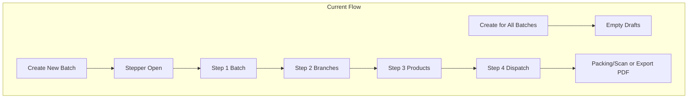

# Allocation Module UI/UX Overhaul Review

## Naming and Terminology


| Current                                        | Problem                                                   | Recommendation                                                                |
| ---------------------------------------------- | --------------------------------------------------------- | ----------------------------------------------------------------------------- |
| Sidebar: "Warehouse Transfer"                  | Vague; implies physical transfer, not allocation planning | Rename to **Create Allocation**                                               |
| Page H2: "Warehouse Batch Allocations"         | Inconsistent with sidebar; "Warehouse" is redundant       | Use **Create Allocation** or **Allocation Management**                        |
| Stepper: "Create New Batch Allocation"         | "Batch" vs "Allocation" overload                          | Simplify to **New Allocation**                                                |
| "Create for All Batches" vs "Create New Batch" | Two CTAs with similar names; unclear relationship         | Distinguish: **Create for All Batches** (bulk) vs **New Allocation** (single) |


**Action**: Rename sidebar item, page title, and stepper header consistently. Use "Allocation" as primary term; "Batch" only when referring to branch batches.

---

## Critical UX Issues

### 1. Two Confusing Entry Points

```
[Create for All Batches]  [Create New Batch]
```

- **Create for All Batches** creates empty draft allocations for every batch number in the system. Users must then click a batch to edit and add products.
- **Create New Batch** opens the stepper to create one allocation with batch selection, branches, products.

**Problem**: Users do not understand when to use which. "Create for All Batches" sounds like a shortcut but produces empty shells. The relationship between the two flows is opaque.

**Recommendation**:

- Add a short helper under the buttons: "Use **Create for All Batches** to pre-create allocations for all branch batches; then edit each to add products. Use **New Allocation** to create a single allocation with full setup."
- Or consolidate: make "Create for All Batches" a secondary/link action; primary CTA = "New Allocation."

### 2. Stepper Steps Have No Labels

The progress indicator shows only circles and connectors—no "Step 1: Batch", "Step 2: Branches", etc.

**Problem**: Users cannot quickly identify their current step without scrolling. Violates basic stepper UX (Nielsen: visibility of system status).

**Recommendation**: Add step labels under each circle, e.g.:

```
(1) Batch  ----  (2) Branches  ----  (3) Products  ----  (4) Review
```

### 3. Step 2 is Largely Passive

Step 2 title: "Branches from Batches: X, Y". Branches are **auto-added** from batch selection. Users do not add branches—they only review.

**Problem**: "Add Branches" implies action; in reality it is "Review Branches." Feels redundant and can be folded into Step 1 or combined with Step 3.

**Recommendation**:

- Rename to **Review Branches** or merge with Step 1 (show branch list after batch selection).
- Or collapse to 3 steps: **1. Batch + Branches**, **2. Products**, **3. Review & Packing**.

### 4. Step 3: Product Selection Complexity

- Filter by Category + Product Number
- Select products from table (checkboxes)
- "Select All Visible" vs "Add Selected"
- "Products Added to Allocation" badge
- Allocation matrix (quantities per branch)
- "Save All Allocations" button with small hint "Save before using Packing/Scan"

**Problems**:

- Too many concepts in one step: filter → select → add → matrix → save.
- "Save All Allocations" is easy to miss; users may proceed to Packing/Scan without saving.
- The hint is subtle; critical for downstream workflow.

**Recommendation**:

- Add a sticky/warning banner when matrix has unsaved changes: "You have unsaved allocation quantities. Save before going to Packing/Scan."
- Consider auto-save on step change or explicit confirmation when leaving Step 3 with unsaved changes.
- Visually emphasize "Save All Allocations" (e.g. primary button styling).

### 5. Step 4: Dead Code and Redundancy

Step 4 contains:

- **Active content**: Packing/Scan link, Export PDF, Branches table, Batch Summary, Overall Scan Summary, Dispatch Batch button.
- **Legacy/disabled content**: `@if (false && $activeBranchId)` hides Box/DR selection and in-stepper barcode scanning. Large blocks of commented/hidden UI.

**Problems**:

- Dead code increases cognitive load and maintenance cost.
- "Review and dispatch... Scan items based on container/truck capacity" copy is outdated—scanning moved to Packing/Scan.
- "Overall Scan Summary" (scanned vs total) may be misleading if scanning is done on another page; values could be stale.
- Layout is fragmented: Branch table, Batch Summary, Scan Summary, warning box, footer buttons—no clear hierarchy.

**Recommendation**:

- Remove all `@if (false)` and commented blocks. Strip dead scanning/Box/DR UI.
- Update copy: "Review your allocation. Use **Packing / Scan** to verify products per branch and box."
- Simplify Step 4 to: (1) Primary actions (Packing/Scan, Export PDF), (2) Branches table, (3) Batch Summary, (4) Dispatch button. Drop or relocate "Overall Scan Summary" to Packing/Scan page if it belongs there.

### 6. Duplicate/Broken Structure

- Duplicate HTML comment: `<!-- STEP 1: CREATE BATCH -->` appears twice (lines 328–329).
- Inconsistent grid: Step 4 has `COLUMN 2` comment and nested `grid-cols-2`; structure is hard to follow.
- Emoji in button: "Update Details" uses 💾—inconsistent with rest of UI.

**Recommendation**: Remove duplicate comments, clean up layout structure, replace emoji with icon or text.

---

## Information Architecture




**Recommendation**: Make the flow explicit in UI—e.g. a small diagram or checklist: "Batch → Branches → Products → Save → Packing/Scan → Dispatch."

---

## Industry Standards Checklist


| Standard                            | Current                               | Gap                            |
| ----------------------------------- | ------------------------------------- | ------------------------------ |
| Clear primary CTA                   | Two equal-weight buttons              | One primary, one secondary     |
| Stepper labels                      | None                                  | Add step names                 |
| Save confirmation                   | None                                  | Warn on unsaved matrix         |
| Consistent naming                   | Warehouse/Batch/Allocation mixed      | Unify on "Allocation"          |
| No dead code in view                | `@if (false)` blocks                  | Remove                         |
| Single source of truth for scanning | Split between Step 4 and Packing/Scan | Consolidate in Packing/Scan    |
| Breadcrumb/context                  | Minimal                               | Add "You are here" for stepper |


---

## Summary of Changes (Prioritized)

1. **Rename**: Sidebar "Warehouse Transfer" → "Create Allocation"; page title and stepper header aligned.
2. **Stepper labels**: Add visible step names (Batch, Branches, Products, Review).
3. **Remove dead code**: Strip `@if (false)` blocks, commented Box/DR/scanning UI.
4. **Step 4 copy**: Update to reflect Packing/Scan as the scanning entry point.
5. **Save awareness**: Banner or confirmation when leaving Step 3 with unsaved matrix.
6. **Entry point clarity**: Differentiate "Create for All Batches" vs "New Allocation" with helper text.
7. **Step 2**: Rename to "Review Branches" or consider merging with Step 1.
8. **Minor**: Remove emoji, fix duplicate comment, tidy grid structure.

---

## Files to Modify

- [resources/views/components/layouts/app/sidebar.blade.php](resources/views/components/layouts/app/sidebar.blade.php) – sidebar label
- [resources/views/livewire/pages/allocation/warehouse.blade.php](resources/views/livewire/pages/allocation/warehouse.blade.php) – page title, stepper, Step 4 cleanup, labels
- [app/Livewire/Pages/Allocation/Warehouse.php](app/Livewire/Pages/Allocation/Warehouse.php) – `#[Title]` attribute if present

