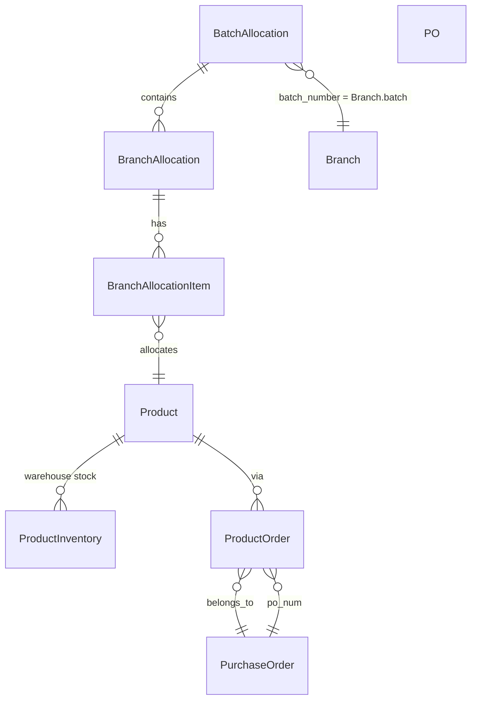

# Allocation Process Analysis: ERP Systems Design Evaluation

## 1. Current State Summary

### Data Model Overview




### Current Allocation Flow (Step 3)


| Aspect                  | Current Behavior                                                                                   |
| ----------------------- | -------------------------------------------------------------------------------------------------- |
| **Product source**      | `getAvailableProductsForBatchProperty()` returns **all products** - no stock or PO filter          |
| **Stock display**       | Matrix shows `initial_quantity` (first ProductInventory.quantity) per product - informational only |
| **Quantity validation** | **None** - user can enter any quantity regardless of stock                                         |
| **PO linkage**          | **None** - BatchAllocation has no relationship to PurchaseOrder                                    |
| **Batch number**        | `batch_number` = Branch grouping (e.g. "Batch A"), NOT PO number                                   |


### Key Code Locations

- Product availability: [Warehouse.php](app/Livewire/Pages/Allocation/Warehouse.php) `getAvailableProductsForBatchProperty()` (line 1572) - returns `Product::orderBy('name')->get()`
- Stock display: [warehouse.blade.php](resources/views/livewire/pages/allocation/warehouse.blade.php) - `{{ intval($product->initial_quantity ?? 0) }}`
- Save validation: `saveMatrixAllocations()` - no stock/PO checks before persisting

---

## 2. Standard ERP Principle vs. User Requirement


| Standard ERP                                                             | User's Requirement                                                                           |
| ------------------------------------------------------------------------ | -------------------------------------------------------------------------------------------- |
| Allocate only what is **in stock** (ProductInventory.available_quantity) | Allocate products **not yet in stock** but arriving via Purchase Order                       |
| Hard validation: allocated <= available                                  | Soft validation with "expected receipt" from PO                                              |
| Single source of truth: warehouse stock                                  | Dual source: stock + PO expected (ProductOrder.quantity - received_quantity - destroyed_qty) |


**Conclusion**: The user operates in a **pre-receipt allocation** model common in distribution: plan allocations against expected PO receipts, then fulfill when stock arrives. This is valid and widely used.

---

## 3. Existing PO/Stock Infrastructure

- **PurchaseOrder**: `po_num`, status (approved, to_receive, received, etc.)
- **ProductOrder**: `quantity` (ordered), `received_quantity`, `destroyed_qty`; `remaining = quantity - received - destroyed`
- **Stock-In flow**: When PO is received via Warehousestaff Stock-In, goods flow into ProductInventory (and ProductBatch)
- **ProductInventory**: warehouse stock by location; `available_quantity = quantity - reserved_quantity`

---

## 4. Design Proposal: PO-Scoped Allocation

### 4.1 Option A: Link Batch to PO (Recommended)

**Concept**: Associate an allocation batch with one or more POs. "Available to allocate" = stock + sum of expected (remaining) quantities from linked POs per product.

**Schema change**:

- Add `purchase_order_ids` (JSON or pivot table) to `batch_allocations` - optional; when set, products and quantities are constrained by those POs.
- Or add `po_num` (string) for single-PO linkage if batches typically map 1:1 to a PO.

**Flow**:

1. Step 1: User selects batch numbers (branch groups) and optionally selects PO(s) for this allocation.
2. Step 3: Product list filtered to products that appear in linked PO(s) OR all products if no PO linked.
3. "Available" per product = `ProductInventory.available_quantity` + `ProductOrder.remaining` (from linked POs).
4. Validation: sum of allocated qty per product across branches <= available.
5. Matrix shows: Stock, Expected (from PO), Total Available, Allocated.

### 4.2 Option B: PO Filter in Add Products Modal (Lightweight)

**Concept**: No schema change. In Add Products modal, add a PO filter dropdown. When a PO is selected, show only products from that PO and display "Expected" = ProductOrder.remaining. No hard validation - informational only. User self-manages.

**Pros**: Minimal changes, quick to implement.  
**Cons**: No enforcement; allocations can exceed expected receipts.

### 4.3 Option C: Reserve on PO (Advanced)

**Concept**: When allocating against a PO, create a "reservation" or "allocation against PO" record. When Stock-In completes, system auto-allocates from that PO's receipt. Requires new tables and workflow changes.

---

## 5. Recommended Approach (Phased)

### Phase 1: PO Filter and Availability Display (Low Risk)

- Add optional PO filter to Add Products modal.
- When PO selected: filter products to those in ProductOrder for that PO.
- In matrix: show `Stock`, `Expected (PO)`, `Total Available = Stock + Expected`.
- No validation yet - display only.

### Phase 2: Validation (Medium Risk)

- On `saveMatrixAllocations()`: validate per product that `sum(allocated across branches) <= (stock + expected from linked PO)`.
- Soft vs hard: configurable or user-choice (warn vs block).

### Phase 3: Batch-PO Linkage (Higher Effort)

- Add `po_num` or `purchase_order_ids` to BatchAllocation.
- Step 1: optional PO selection; when set, Step 3 auto-filters and constrains by that PO.
- Enables reporting: "Allocations against PO-2025-001".

---

## 6. Implementation Considerations

### 6.1 "Available to Allocate" Formula

```
available = ProductInventory.sum(available_quantity) 
          + ProductOrder.where(purchase_order_id IN linked_POs)
                        .where(product_id)
                        .sum(remaining_quantity)
```

### 6.2 ProductOrder.remaining

Already exists: `quantity - received_quantity - destroyed_qty` (see [ProductOrder.php](app/Models/ProductOrder.php) `getRemainingQuantityAttribute()`).

### 6.3 PO Status

Only include POs with status `approved` or `to_receive` when computing expected receipts. Exclude `received`, `cancelled`, etc.

### 6.4 Multi-PO Scenario

If one batch can draw from multiple POs, sum expected from each. Ensure no double-counting when same product appears in multiple POs.

---

## 7. Summary


| Item                                       | Status                                         |
| ------------------------------------------ | ---------------------------------------------- |
| Current allocation validates stock         | No - no validation                             |
| Current allocation links to PO             | No                                             |
| ProductOrder/PO model supports "remaining" | Yes                                            |
| Recommended first step                     | Add PO filter + availability display (Phase 1) |


This analysis provides the basis for implementing PO-aware allocation. The next step is to choose Phase 1, 2, 3, or a subset and implement accordingly.