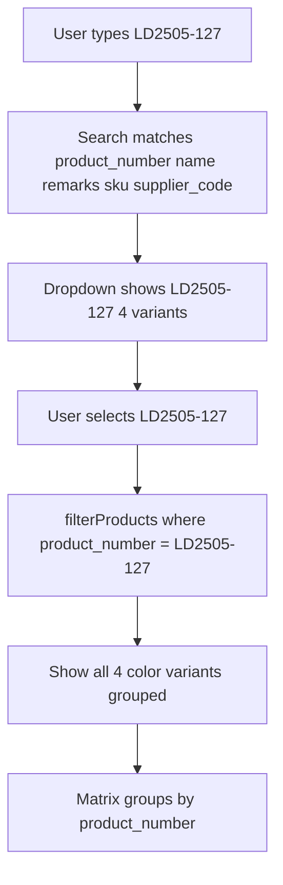

# Allocation Product Number Search and Grouping

## Current vs Desired Workflow

| Current                                                          | Desired                                                                   |
| ---------------------------------------------------------------- | ------------------------------------------------------------------------- |
| Search returns product names; selecting one shows single variant | Search by product number; selecting "LD2505-127" shows all color variants |
| Matrix groups by full product name (each variant separate)       | Matrix groups by product_number (variants together)                       |
| Filter uses exact name match                                     | Filter uses product_number match                                          |

## Changes

### 1. Search optimization

**File:** [app/Livewire/Pages/Allocation/Warehouse.php](app/Livewire/Pages/Allocation/Warehouse.php)

- Ensure search covers: `name`, `remarks`, `product_number`, `supplier_code`, `sku` (product_number is already in `getFilteredProductNamesForDropdownProperty`; add `remarks`).
- Add `selectedProductFilterProductNumber` to support filtering by product number.
- Add `getFilteredProductNumbersForDropdownProperty()`: returns unique `product_number` values for products matching the search, each with a variant count, e.g. `[['product_number' => 'LD2505-127', 'variant_count' => 4], ...]`.

### 2. Dropdown: product number as primary option

**File:** [resources/views/livewire/pages/allocation/warehouse.blade.php](resources/views/livewire/pages/allocation/warehouse.blade.php)

- Change dropdown to show **product numbers** that match the search (e.g. "LD2505-127 (4 variants)") instead of full product names.
- Update placeholder to: "Search by product number, name, SKU, or Supplier Code..."
- On selection, set `selectedProductFilterProductNumber` (and clear `selectedProductFilterName` when using product number).

### 3. Filter by product number

**File:** [app/Livewire/Pages/Allocation/Warehouse.php](app/Livewire/Pages/Allocation/Warehouse.php)

- Update `filterProducts()`:
  - If `selectedProductFilterProductNumber` is set: `->where('product_number', $selectedProductFilterProductNumber)`.
  - Else if `selectedProductFilterName` is set: keep `->where('name', $selectedProductFilterName)` for backward compatibility.
- Ensure "All Products" clears both filters.

### 4. Group by product_number in matrix

**File:** [resources/views/livewire/pages/allocation/warehouse.blade.php](resources/views/livewire/pages/allocation/warehouse.blade.php)

- Change `$groupedProducts = $products->groupBy('name')` to `$products->groupBy(fn ($p) => $p->product_number ?? $p->name)`.
- Use `product_number` (or fallback to `name`) for the group header instead of full product name.

### 5. Dropdown selection handlers

**File:** [app/Livewire/Pages/Allocation/Warehouse.php](app/Livewire/Pages/Allocation/Warehouse.php)

- Add `selectProductFilterByProductNumber(string $productNumber)`.
- Update `selectProductFilter(null)` to also clear `selectedProductFilterProductNumber`.
- Adjust `getFilteredProductNumbersForDropdownProperty()` to return a structure usable for both display and selection (e.g. list of product numbers with counts).

## Data flow

## Optional: fallback to name-based filter

- Keep `selectedProductFilterName` and the name-based branch in `filterProducts()` so that if the dropdown later supports names (e.g. "All Products" or a mixed mode), existing behavior still works.

