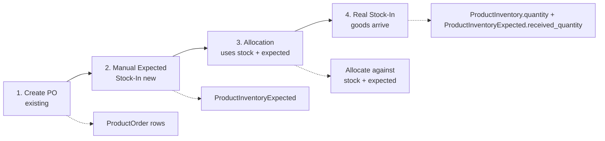
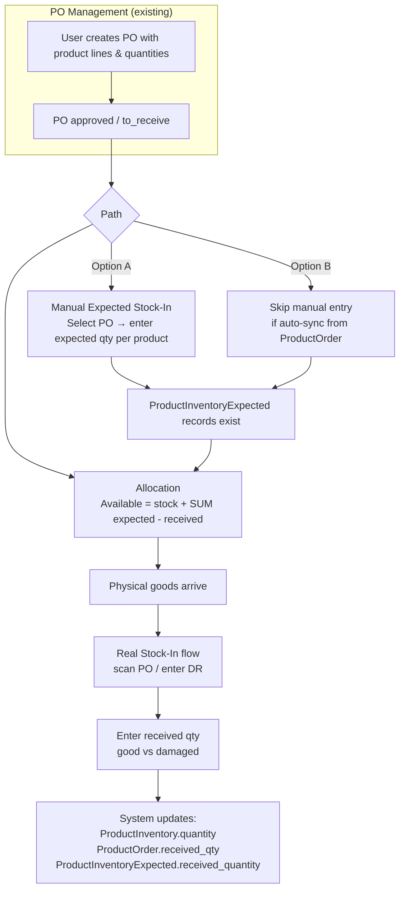

# Allocation Stock Source: Manual Stock-In / Expected Ledger

**Decision:** Approach B (Manual Stock-In with PO Reference) is the chosen design. This plan documents the finalized model and implementation.

---

## Data Model: Expected Inventory Ledger

Use a dedicated `product_inventory_expected` table linked to PO, instead of deriving expected from ProductOrder on the fly.

```mermaid
erDiagram
    ProductInventory ||--o{ ProductInventoryExpected : "has expected"
    ProductInventoryExpected }o--|| PurchaseOrder : "from PO"
    
    ProductInventory {
        product_id PK
        quantity "physical"
        available_quantity "physical - reserved"
    }
    
    ProductInventoryExpected {
        product_id PK
        purchase_order_id PK
        expected_quantity int
        received_quantity int "filled on real stock-in"
    }
```


**Available to allocate** = `ProductInventory.available_quantity` + `SUM(ProductInventoryExpected.expected_quantity - received_quantity)` for the product (optionally filtered by linked PO).

**Manual Expected Stock-In** = Create/update `ProductInventoryExpected` for a product + PO with `expected_quantity`. User enters "We expect X from PO-YYY."

**Real Stock-In** (when goods arrive):

1. Increment `ProductInventory.quantity`
2. Increment `ProductInventoryExpected.received_quantity` for that product + PO
3. Mark PO/ProductOrder as received as today

No double-counting: expected is reduced as physical is increased.

---

## Workflow

**Important:** The PO must exist first. Manual Expected Stock-In always references an existing PO.

### High-Level Flow




### Detailed Flowchart




### Sequence Summary


| Step | Action                           | Who                 | When                                         |
| ---- | -------------------------------- | ------------------- | -------------------------------------------- |
| 1    | Create PO with product lines     | Buyer / Purchasing  | Before anything                              |
| 2    | Approve PO                       | Approver            | After creation                               |
| 3    | Record expected from PO (manual) | Warehouse / Planner | When PO is confirmed (optional if auto-sync) |
| 4    | Allocate                         | Allocation staff    | Anytime; uses stock + expected               |
| 5    | Physical arrival – Real Stock-In | Warehouse staff     | When goods arrive                            |


**Manual Expected Stock-In** does not create the PO. It explicitly records "we expect X units from PO-YYY" so allocation treats it as available. Without it (and without auto-sync), expected = 0. With it, allocation can use stock + expected.

---

## Implementation Plan

### Schema & Model (~0.5 day)

- Create migration for `product_inventory_expected`:
  - `product_id`, `purchase_order_id`, `expected_quantity`, `received_quantity`, timestamps
  - Unique index on `(product_id, purchase_order_id)`
- Create `ProductInventoryExpected` model with relationships to Product and PurchaseOrder

### Allocation Logic (~0.5 day)

- Update `AllocationAvailabilityHelper::getExpectedQuantityFromPO()` to read from `ProductInventoryExpected` instead of `ProductOrder.remaining`
- Formula: `SUM(expected_quantity - received_quantity)` for product (optionally filtered by PO)

### Real Stock-In Integration (~1 day)

- In `StockIn/Index::submitStockInReport()`, after updating ProductInventory and ProductOrder:
  - Find or create `ProductInventoryExpected` for product + PO
  - Increment `received_quantity` by the received amount
- Handle case when `ProductInventoryExpected` does not exist (create on first receipt or skip)

### Manual Expected Stock-In UI (~1–2 days)

- New route and Livewire page (e.g. `/warehousestaff/expected-stockin` or under existing Stock-In)
- Flow: Select PO → list products (from PO or manual add) → enter expected qty per product → save
- Creates/updates `ProductInventoryExpected` records
- Use slideover or form pattern per project conventions

### Optional: Auto-Sync from ProductOrder (+0.5–1 day)

- When PO is approved (or to_receive), create/update `ProductInventoryExpected` from `ProductOrder` lines
- One-time migration to seed from existing approved POs (optional)
- Preserves current "expected = PO remaining" behavior without manual entry

### Effort Summary


| Variant                          | Estimate  |
| -------------------------------- | --------- |
| Minimal (manual only, no sync)   | ~3–4 days |
| With auto-sync from ProductOrder | ~4–5 days |
| With one-time data migration     | +0.5 day  |


---

## Task Breakdown (Senior Engineer)

Each task includes requirement mapping, acceptance criteria, dependencies, and edge cases.

### Phase 1: Schema & Model


| ID  | Task                                          | Requirement | Acceptance Criteria                                                                                                                                                                                                                                              | Dependencies | Edge Cases                                                                                                           |
| --- | --------------------------------------------- | ----------- | ---------------------------------------------------------------------------------------------------------------------------------------------------------------------------------------------------------------------------------------------------------------- | ------------ | -------------------------------------------------------------------------------------------------------------------- |
| T1  | Create `product_inventory_expected` migration | Data model  | Table exists with `product_id`, `purchase_order_id`, `expected_quantity`, `received_quantity`, timestamps; unique index on `(product_id, purchase_order_id)`; FKs to products and purchase_orders; `expected_quantity` and `received_quantity` are decimal(15,3) | None         | Handle down migration; ensure FK cascade/restrict is appropriate                                                     |
| T2  | Create `ProductInventoryExpected` model       | Data model  | Model with fillable, casts, `product()`, `purchaseOrder()` relations; scopes for byProduct, byPO; docblocks                                                                                                                                                      | T1           | Add `expected_quantity` ≥ 0, `received_quantity` ≤ `expected_quantity` validation in model/business layer if desired |


### Phase 2: Allocation Logic


| ID  | Task                                  | Requirement                  | Acceptance Criteria                                                                                                                                                                                                                                                                 | Dependencies | Edge Cases                                                                      |
| --- | ------------------------------------- | ---------------------------- | ----------------------------------------------------------------------------------------------------------------------------------------------------------------------------------------------------------------------------------------------------------------------------------- | ------------ | ------------------------------------------------------------------------------- |
| T3  | Update `AllocationAvailabilityHelper` | Available = stock + expected | `getExpectedQuantityFromPO(product, poId)` reads from `ProductInventoryExpected`; returns 0 when poId is null; formula: `SUM(expected_quantity - received_quantity)` for product+PO; only include POs with status approved/to_receive; `getAvailableToAllocate` unchanged signature | T1, T2       | When no ProductInventoryExpected rows exist, return 0; handle decimal precision |


### Phase 3: Real Stock-In Integration


| ID  | Task                      | Requirement                           | Acceptance Criteria                                                                                                                                                                                                                   | Dependencies | Edge Cases                                                                                                                                                                  |
| --- | ------------------------- | ------------------------------------- | ------------------------------------------------------------------------------------------------------------------------------------------------------------------------------------------------------------------------------------- | ------------ | --------------------------------------------------------------------------------------------------------------------------------------------------------------------------- |
| T4  | Update Real Stock-In flow | Real stock-in updates expected ledger | In `submitStockInReport()`, after updating ProductInventory and ProductOrder for good items: find `ProductInventoryExpected` for product+PO; if exists, increment `received_quantity` by `actualReceive`; if not exists, skip (no-op) | T1, T2       | Record may not exist (manual entry not done); never create on receipt; cap `received_quantity` at `expected_quantity` to avoid overflow; run inside existing DB transaction |


### Phase 4: Manual Expected Stock-In UI


| ID  | Task                      | Requirement                              | Acceptance Criteria                                                                                                                                           | Dependencies | Edge Cases                                                |
| --- | ------------------------- | ---------------------------------------- | ------------------------------------------------------------------------------------------------------------------------------------------------------------- | ------------ | --------------------------------------------------------- |
| T5  | Add route and nav         | Users can reach Manual Expected Stock-In | Route `/warehousestaff/expected-stockin` (or equivalent); nav link under Warehousestaff/Stock-In area                                                         | None         | Gate by same permissions as existing Stock-In             |
| T6  | Create Livewire component | Manual Expected Stock-In flow            | Component: `loadAvailablePurchaseOrders()` (approved/to_receive); `loadProductsForPO(poId)`; `expectedQuantities` array keyed by product_id; `saveExpected()` | T1, T2       | Handle empty PO list; handle PO with no products          |
| T7  | Build view                | UI for Manual Expected Stock-In          | PO dropdown; product list with expected qty input per product; Save button; success/error feedback; use slideover or form per project patterns                | T6           | Validate qty ≥ 0; allow 0 to clear expected               |
| T8  | Validation and save       | Manual entry creates/updates expected    | On save: upsert `ProductInventoryExpected` per product with qty > 0; delete or set 0 when user clears; validate expected_quantity ≥ received_quantity         | T6, T7       | Concurrent edits; ensure PO exists and is in valid status |


### Phase 5: Optional Auto-Sync & Seeding


| ID  | Task                    | Requirement           | Acceptance Criteria                                                                                                                                                                                                        | Dependencies     | Edge Cases                                                             |
| --- | ----------------------- | --------------------- | -------------------------------------------------------------------------------------------------------------------------------------------------------------------------------------------------------------------------- | ---------------- | ---------------------------------------------------------------------- |
| T9  | Auto-sync on PO approve | Option B in workflow  | When PO status becomes approved/to_receive: create/update `ProductInventoryExpected` from ProductOrder lines; expected_quantity = ProductOrder.quantity (or remaining); received_quantity = ProductOrder.received_quantity | T1, T2           | Use Observer or event; handle status transitions; idempotent on re-run |
| T10 | One-time seed migration | Backfill existing POs | Migration: for each approved/to_receive PO, create ProductInventoryExpected from ProductOrder where not exists; expected_quantity = remaining, received_quantity = received_quantity                                       | T1, T2, T9 logic | Run once; safe to re-run (use firstOrCreate)                           |


### Requirement Coverage


| Requirement                                                         | Tasks                        |
| ------------------------------------------------------------------- | ---------------------------- |
| Available = stock + SUM(expected - received)                        | T3                           |
| Manual Expected Stock-In creates ProductInventoryExpected           | T6, T7, T8                   |
| Real Stock-In increments ProductInventoryExpected.received_quantity | T4                           |
| PO must exist first                                                 | T6 (load POs), T8 (validate) |
| Single source of truth for expected                                 | T1, T2, T3, T4               |
| No double-counting (expected reduced as physical increased)         | T4                           |
| Optional auto-sync from ProductOrder                                | T9, T10                      |


### Execution Order

```
T1 → T2 → T3 (allocation works with new source)
        ↘ T4 (real stock-in updates expected)
        ↘ T5 → T6 → T7 → T8 (manual expected UI)
        ↘ T9 → T10 (optional)
```

T3 and T4 can run in parallel after T2. T5–T8 are sequential. T9–T10 depend on T2.

### Testing Checklist (Per Phase)

- **Phase 1:** Run migration up/down; verify table structure and FKs
- **Phase 2:** Unit test `getExpectedQuantityFromPO` and `getAvailableToAllocate` with ProductInventoryExpected data; verify allocation matrix shows correct Expected and Total Available
- **Phase 3:** E2E: Real stock-in → verify ProductInventoryExpected.received_quantity increments; verify no create when record absent
- **Phase 4:** E2E: Manual Expected Stock-In → save → verify ProductInventoryExpected created/updated; verify allocation matrix reflects new expected
- **Phase 5:** (If implemented) Verify auto-sync on PO approve; verify seed migration is idempotent

---

## Key Files to Modify


| File                                                                        | Change                                                             |
| --------------------------------------------------------------------------- | ------------------------------------------------------------------ |
| `app/Support/AllocationAvailabilityHelper.php`                              | Switch expected source to ProductInventoryExpected                 |
| `app/Livewire/Pages/Warehousestaff/StockIn/Index.php`                       | Update ProductInventoryExpected.received_quantity on real stock-in |
| New: `database/migrations/xxxx_create_product_inventory_expected_table.php` | Add table                                                          |
| New: `app/Models/ProductInventoryExpected.php`                              | Add model                                                          |
| New: Manual Expected Stock-In Livewire component + view                     | New UI flow                                                        |


---

## Rationale: Why This Approach


| Benefit                      | Impact                                                  |
| ---------------------------- | ------------------------------------------------------- |
| Single source of truth       | Allocation and reports use the same inventory model     |
| Clear audit trail            | Expected quantity tied to PO; reconciled on receipt     |
| Standard ERP pattern         | Matches "on order" / "in transit" / "expected receipts" |
| Simpler reporting            | Inventory report = sum of ledger buckets                |
| No over-commitment confusion | Expected ledger is explicit, not derived from PO lines  |


---

## Appendix: Rejected Alternative (ProductOrder.remaining)

**Approach A (Pre-Receipt / Current):** Available = `ProductInventory.available_quantity` + `ProductOrder.remaining`. Rejected due to dual source of truth, reconciliation complexity, and weak PO traceability.

**Simpler schema alternative:** Add `expected_quantity` and `expected_from_po_id` directly to `product_inventory`. Rejected because only one PO per product can be tracked; separate `product_inventory_expected` table supports multiple POs per product.