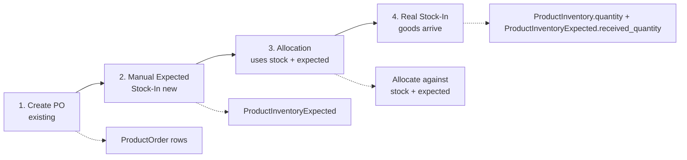
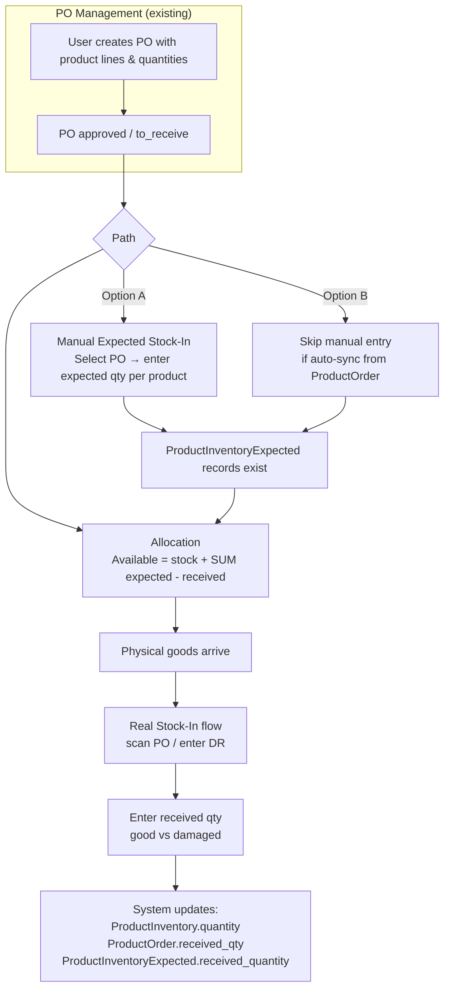

# Allocation Stock Source: Manual Stock-In / Expected Ledger

**Decision:** Approach B (Manual Stock-In with PO Reference) is the chosen design. This plan documents the finalized model and implementation.

---

## Data Model: Expected Inventory Ledger

Use a dedicated `product_inventory_expected` table linked to PO, instead of deriving expected from ProductOrder on the fly.

```mermaid
erDiagram
    ProductInventory ||--o{ ProductInventoryExpected : "has expected"
    ProductInventoryExpected }o--|| PurchaseOrder : "from PO"
    
    ProductInventory {
        product_id PK
        quantity "physical"
        available_quantity "physical - reserved"
    }
    
    ProductInventoryExpected {
        product_id PK
        purchase_order_id PK
        expected_quantity int
        received_quantity int "filled on real stock-in"
    }
```


**Available to allocate** = `ProductInventory.available_quantity` + `SUM(ProductInventoryExpected.expected_quantity - received_quantity)` for the product (optionally filtered by linked PO).

**Manual Expected Stock-In** = Create/update `ProductInventoryExpected` for a product + PO with `expected_quantity`. User enters "We expect X from PO-YYY."

**Real Stock-In** (when goods arrive):

1. Increment `ProductInventory.quantity`
2. Increment `ProductInventoryExpected.received_quantity` for that product + PO
3. Mark PO/ProductOrder as received as today

No double-counting: expected is reduced as physical is increased.

---

## Workflow

**Important:** The PO must exist first. Manual Expected Stock-In always references an existing PO.

### High-Level Flow




### Detailed Flowchart




### Sequence Summary


| Step | Action                           | Who                 | When                                         |
| ---- | -------------------------------- | ------------------- | -------------------------------------------- |
| 1    | Create PO with product lines     | Buyer / Purchasing  | Before anything                              |
| 2    | Approve PO                       | Approver            | After creation                               |
| 3    | Record expected from PO (manual) | Warehouse / Planner | When PO is confirmed (optional if auto-sync) |
| 4    | Allocate                         | Allocation staff    | Anytime; uses stock + expected               |
| 5    | Physical arrival – Real Stock-In | Warehouse staff     | When goods arrive                            |


**Manual Expected Stock-In** does not create the PO. It explicitly records "we expect X units from PO-YYY" so allocation treats it as available. Without it (and without auto-sync), expected = 0. With it, allocation can use stock + expected.

---

## Implementation Plan

### Schema & Model (~0.5 day)

- Create migration for `product_inventory_expected`:
  - `product_id`, `purchase_order_id`, `expected_quantity`, `received_quantity`, timestamps
  - Unique index on `(product_id, purchase_order_id)`
- Create `ProductInventoryExpected` model with relationships to Product and PurchaseOrder

### Allocation Logic (~0.5 day)

- Update `AllocationAvailabilityHelper::getExpectedQuantityFromPO()` to read from `ProductInventoryExpected` instead of `ProductOrder.remaining`
- Formula: `SUM(expected_quantity - received_quantity)` for product (optionally filtered by PO)

### Real Stock-In Integration (~1 day)

- In `StockIn/Index::submitStockInReport()`, after updating ProductInventory and ProductOrder:
  - Find or create `ProductInventoryExpected` for product + PO
  - Increment `received_quantity` by the received amount
- Handle case when `ProductInventoryExpected` does not exist (create on first receipt or skip)

### Manual Expected Stock-In UI (~1–2 days)

- New route and Livewire page (e.g. `/warehousestaff/expected-stockin` or under existing Stock-In)
- Flow: Select PO → list products (from PO or manual add) → enter expected qty per product → save
- Creates/updates `ProductInventoryExpected` records
- Use slideover or form pattern per project conventions

### Optional: Auto-Sync from ProductOrder (+0.5–1 day)

- When PO is approved (or to_receive), create/update `ProductInventoryExpected` from `ProductOrder` lines
- One-time migration to seed from existing approved POs (optional)
- Preserves current "expected = PO remaining" behavior without manual entry

### Effort Summary


| Variant                          | Estimate  |
| -------------------------------- | --------- |
| Minimal (manual only, no sync)   | ~3–4 days |
| With auto-sync from ProductOrder | ~4–5 days |
| With one-time data migration     | +0.5 day  |


---

## Key Files to Modify


| File                                                                        | Change                                                             |
| --------------------------------------------------------------------------- | ------------------------------------------------------------------ |
| `app/Support/AllocationAvailabilityHelper.php`                              | Switch expected source to ProductInventoryExpected                 |
| `app/Livewire/Pages/Warehousestaff/StockIn/Index.php`                       | Update ProductInventoryExpected.received_quantity on real stock-in |
| New: `database/migrations/xxxx_create_product_inventory_expected_table.php` | Add table                                                          |
| New: `app/Models/ProductInventoryExpected.php`                              | Add model                                                          |
| New: Manual Expected Stock-In Livewire component + view                     | New UI flow                                                        |


---

## Rationale: Why This Approach


| Benefit                      | Impact                                                  |
| ---------------------------- | ------------------------------------------------------- |
| Single source of truth       | Allocation and reports use the same inventory model     |
| Clear audit trail            | Expected quantity tied to PO; reconciled on receipt     |
| Standard ERP pattern         | Matches "on order" / "in transit" / "expected receipts" |
| Simpler reporting            | Inventory report = sum of ledger buckets                |
| No over-commitment confusion | Expected ledger is explicit, not derived from PO lines  |


---

## Appendix: Rejected Alternative (ProductOrder.remaining)

**Approach A (Pre-Receipt / Current):** Available = `ProductInventory.available_quantity` + `ProductOrder.remaining`. Rejected due to dual source of truth, reconciliation complexity, and weak PO traceability.

**Simpler schema alternative:** Add `expected_quantity` and `expected_from_po_id` directly to `product_inventory`. Rejected because only one PO per product can be tracked; separate `product_inventory_expected` table supports multiple POs per product.