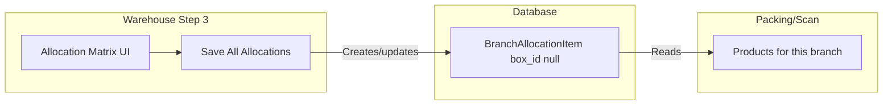

# Save All Allocations and Packing/Scan

## What "Save All Allocations" Does

The **Save All Allocations** button in [warehouse.blade.php](resources/views/livewire/pages/allocation/warehouse.blade.php) (around line 861) calls `saveMatrixAllocations()` in [Warehouse.php](app/Livewire/Pages/Allocation/Warehouse.php).

`saveMatrixAllocations()` (lines 1586-1658):

1. **Deletes** `BranchAllocationItem` records for products no longer in the selection (per branch)
2. **Creates or updates** `BranchAllocationItem` records from the allocation matrix:
  - For each (branch, product) with quantity > 0: create if missing, else update `quantity` and `unit_price`
  - For quantity 0: delete the allocation item
3. **Persists** these changes to the database (these are the "base" allocation items with `box_id` null)

## Packing/Scan Does Use Saved Allocations

Packing/Scan reads from the same source:

- [Scanning.php](app/Livewire/Pages/Allocation/Scanning.php) `getAllocatableProductsProperty()` (lines 73-96) queries:
  ```php
  BranchAllocationItem::where('branch_allocation_id', ...)->whereNull('box_id')
  ```

These are the same records `saveMatrixAllocations` creates and updates. **Packing/Scan is based on saved allocations.**

## Bug: Base vs Scanned Items

`saveMatrixAllocations` does **not** filter by `box_id` when finding existing items or when deleting:

```php
// Line 1601-1605: Delete - affects ALL items including scanned ones
BranchAllocationItem::whereIn('branch_allocation_id', ...)
    ->whereNotIn('product_id', ...)
    ->delete();

// Line 1618-1622: existingItem - could return scanned item (box_id set)
$existingItem = BranchAllocationItem::where(...)->where('product_id', $productId)->first();
```

When scanning creates new `BranchAllocationItem` records with `box_id` set, both base (box_id null) and scanned (box_id set) items exist for the same product+branch. The save logic could:

- Update or delete a **scanned** item instead of the base one
- Delete **scanned** items when a product is deselected (wrong—scanned items are physical records)

## Fix

Update [Warehouse.php](app/Livewire/Pages/Allocation/Warehouse.php) `saveMatrixAllocations()`:

1. **Delete** (lines 1601-1605): Add `->whereNull('box_id')` so only base allocation items are removed
2. **existingItem** (lines 1618-1622): Add `->whereNull('box_id')` so we always target the base item

Similarly, **loadMatrix()** (line 1579) uses `$branchAllocation->items->where('product_id', $productId)->first()` which can return a scanned item. Filter by base items only (e.g. use `$branchAllocation->items()->whereNull('box_id')->where('product_id', $productId)->first()`).

## Flow Summary




## Optional UX

Consider a short hint near "Save All Allocations": e.g. "Save before using Packing/Scan" so users know changes must be saved first.