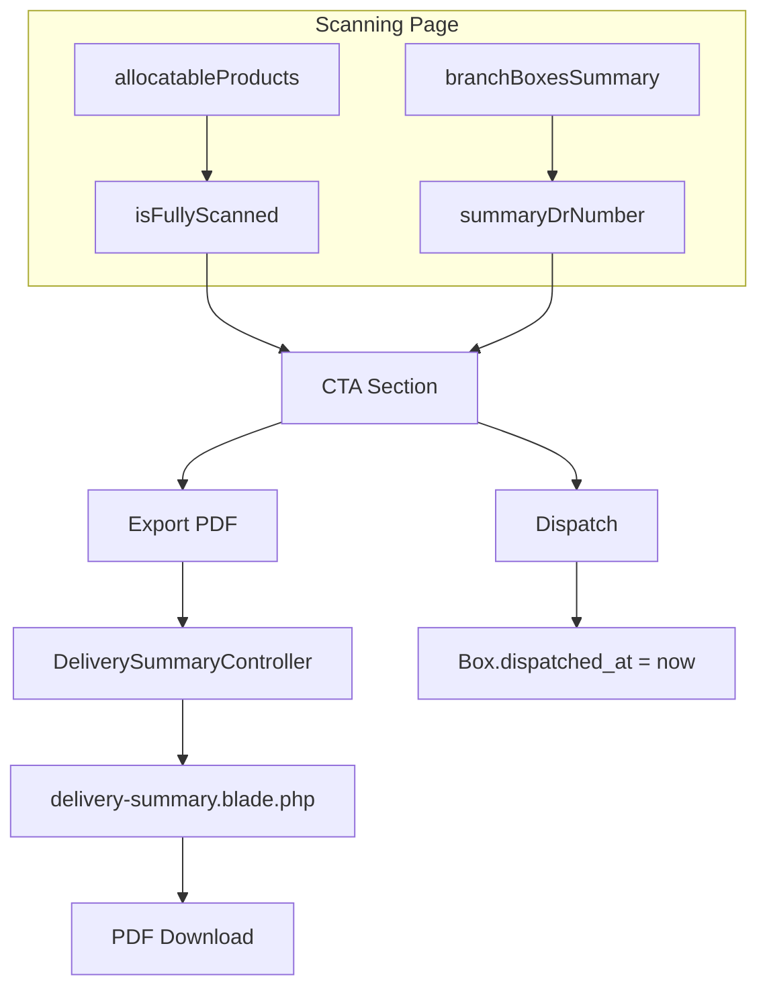

# Scanning Page: Export Delivery Summary and Dispatch CTA

## Context

The Packing/Scan page ([resources/views/livewire/pages/allocation/scanning.blade.php](resources/views/livewire/pages/allocation/scanning.blade.php)) lets users scan products into boxes for a branch. Each box has a DeliveryReceipt (DR); the first box's DR is the "mother" DR (summary reference). Boxes and DRs are scoped to `selectedBranchAllocationId`.

## Requirements

1. **When to show CTAs:** After the user has finished scanning all products for the branch (every product has remaining = 0).
2. **Export Delivery Summary:** Download a PDF with:
  - Summary DR # as header reference (mother DR number)
  - Branch name, date
  - Table: all boxes with Box #, DR #, Items (count)
  - Total boxes, total items
3. **Dispatch for shipment:** Mark boxes as dispatched (`dispatched_at`), with summary DR # shown as reference. Confirmation before action.

---

## Implementation Plan

### 1. "Fully scanned" state

**File:** [app/Livewire/Pages/Allocation/Scanning.php](app/Livewire/Pages/Allocation/Scanning.php)

Add computed property:

```php
/** True when all products for this branch are fully scanned (remaining = 0 for each) */
public function getIsFullyScannedProperty(): bool
{
    $products = $this->allocatableProducts;
    if ($products->isEmpty()) {
        return false; // No products allocated
    }
    return $products->every(fn ($p) => $p->remaining <= 0);
}
```

Add property for summary DR number:

```php
/** Mother DR number for this branch (summary reference) - null if no boxes/DRs */
public function getSummaryDrNumberProperty(): ?string
{
    if (!$this->selectedBranchAllocationId) {
        return null;
    }
    $mother = DeliveryReceipt::where('branch_allocation_id', $this->selectedBranchAllocationId)
        ->where('type', 'mother')
        ->first();
    return $mother?->dr_number;
}
```

---

### 2. CTA section in the view

**File:** [resources/views/livewire/pages/allocation/scanning.blade.php](resources/views/livewire/pages/allocation/scanning.blade.php)

Place after the right column (Branch summary + Products), inside the `@if($selectedBranchAllocationId)` block, below the Products table. Structure:

- Only render when `$this->isFullyScanned` and `$this->branchBoxesSummary->isNotEmpty()`
- Card with heading: "Scanning complete"
- Short note: summary DR # as reference
- Two buttons:
  1. **Export Delivery Summary** – primary (e.g. document / PDF icon), calls `exportDeliverySummary`
  2. **Dispatch for shipment** – secondary (e.g. truck icon), `wire:click="dispatchForShipment"` with `wire:confirm` (confirm dispatch; mention summary DR #)

---

### 3. Export Delivery Summary (PDF)

**New controller method or dedicated controller:** e.g. `DeliverySummaryController` or extend existing `DeliveryReceiptController`.

**Route:** `GET /allocation/delivery-summary/pdf/{branchAllocationId}` (or similar).

**Logic:**

- Load `BranchAllocation` with `branch`, `boxes.deliveryReceipts`
- Mother DR = `DeliveryReceipt::where('branch_allocation_id', ...)->where('type', 'mother')->first()`
- Summary DR # = mother DR `dr_number` (or first box's DR if no mother)
- Build data: branch name, date, summary DR #, list of boxes (box_number, dr_number, item_count)
- Load view `pdfs.delivery-summary`
- Return PDF download

**New PDF view:** [resources/views/pdfs/delivery-summary.blade.php](resources/views/pdfs/delivery-summary.blade.php)

- Header: Brand, date, branch name, **Summary DR #**
- Table: Box # | DR # | Items
- Footer: Total boxes, total items, run date

Reuse styling from [resources/views/pdfs/delivery-receipt.blade.php](resources/views/pdfs/delivery-receipt.blade.php).

**Scanning.php method:**

```php
public function exportDeliverySummary(): mixed
{
    // Redirect to route or dispatch browser download
    $url = route('allocation.delivery-summary.pdf', ['branchAllocationId' => $this->selectedBranchAllocationId]);
    $this->dispatch('open-pdf-download', url: $url);
    session()->flash('message', 'Delivery summary PDF downloaded.');
}
```

Ensure the route exists and the `open-pdf-download` listener is wired (see Warehouse usage).

---

### 4. Dispatch for shipment

**File:** [app/Livewire/Pages/Allocation/Scanning.php](app/Livewire/Pages/Allocation/Scanning.php)

```php
public function dispatchForShipment(): void
{
    if (!$this->selectedBranchAllocationId) {
        session()->flash('error', 'No branch selected.');
        return;
    }

    Box::where('branch_allocation_id', $this->selectedBranchAllocationId)
        ->whereNull('dispatched_at')
        ->update(['dispatched_at' => now()]);

    $this->loadAvailableBoxes();
    session()->flash('message', 'Branch shipment dispatched. Summary DR: ' . ($this->summaryDrNumber ?? 'N/A'));
}
```

**Scope:** Only this branch allocation’s boxes are dispatched. Batch status and SalesReceipt creation remain unchanged; full batch dispatch stays in the Warehouse flow.

**Confirmation:** Use `wire:confirm` with copy like: `"Dispatch this shipment? Summary DR: {summaryDrNumber}. Boxes will be marked as dispatched."`

---

### 5. Route registration

**File:** [routes/web.php](routes/web.php)

Add inside the allocation route group:

```php
Route::get('/allocation/delivery-summary/pdf/{branchAllocationId}', [DeliverySummaryController::class, 'exportPdf'])
    ->name('allocation.delivery-summary.pdf');
```

---

## Data flow (summary)




---

## Files to create or modify


| File                                                                                                                         | Action                                                                                                        |
| ---------------------------------------------------------------------------------------------------------------------------- | ------------------------------------------------------------------------------------------------------------- |
| [app/Livewire/Pages/Allocation/Scanning.php](app/Livewire/Pages/Allocation/Scanning.php)                                     | Add `getIsFullyScannedProperty`, `getSummaryDrNumberProperty`, `exportDeliverySummary`, `dispatchForShipment` |
| [resources/views/livewire/pages/allocation/scanning.blade.php](resources/views/livewire/pages/allocation/scanning.blade.php) | Add CTA section below Products table (conditional)                                                            |
| `app/Http/Controllers/DeliverySummaryController.php`                                                                         | Create; `exportPdf($branchAllocationId)`                                                                      |
| [resources/views/pdfs/delivery-summary.blade.php](resources/views/pdfs/delivery-summary.blade.php)                           | Create PDF view                                                                                               |
| [routes/web.php](routes/web.php)                                                                                             | Register delivery-summary route                                                                               |


---

## Edge cases

- **No mother DR:** Use first box’s DR number as summary reference.
- **No boxes:** CTA hidden (branchBoxesSummary empty).
- **Empty allocation:** `isFullyScanned` false (no products).
- **Already dispatched boxes:** Dispatch action only updates boxes where `dispatched_at` is null.
- **open-pdf-download:** Confirm the app already listens for this (e.g. in layout or Alpine) as in Warehouse; if not, add it.

