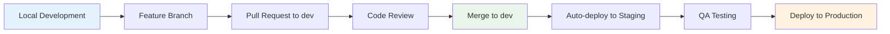

# 🐾 CliqueHA - Development

[](https://github.com/CliqueHA-Information-Services/gentle-walker/tree/dev)
[](https://github.com/CliqueHA-Information-Services/gentle-walker/actions)
[](https://laravel.com)
[](https://php.net)

> **🚀 Development Branch** - Latest features and active development work

## 🏢 About CliqueHA

CliqueHA is a **modern Laravel-based inventory management system** designed specifically for pet supply businesses. This is the **main development branch** where all new features and improvements are built before being promoted to staging and production.

### 🌟 Core Features

- **📦 Inventory Management** - Real-time stock tracking, batch management, and automated reordering
- **💰 Sales & Returns** - Complete sales order lifecycle with integrated returns processing  
- **📋 Purchase Orders** - Automated supplier management and smart procurement workflows
- **🚚 Shipment Tracking** - End-to-end delivery management with QR code integration
- **👥 Multi-user System** - Role-based permissions (Admin, Manager, Staff)
- **📊 Financial Reporting** - Real-time P&L statements, receivables, and payable tracking
- **🔄 Real-time Updates** - WebSocket-powered live notifications and updates

## 🚀 Quick Start

### Local Development Setup

```bash
# Clone the development branch
git clone -b dev https://github.com/CliqueHA-Information-Services/gentle-walker.git
cd gentle-walker

# Install PHP dependencies
composer install

# Install Node.js dependencies  
npm install

# Setup environment
cp .env.example .env
php artisan key:generate

# Configure database (update .env with your settings)
DB_CONNECTION=mysql
DB_HOST=127.0.0.1
DB_PORT=3306
DB_DATABASE=gentle_walker_dev
DB_USERNAME=your_username
DB_PASSWORD=your_password

# Run migrations and seed data
php artisan migrate --seed

# Build frontend assets
npm run dev

# Start development server
php artisan serve
```

### Docker Development Environment

```bash
# Quick Docker setup for development
docker-compose up -d

# Run migrations in Docker
docker-compose exec app php artisan migrate --seed

# Watch for changes (in separate terminal)
npm run dev
```

## 🛠️ Development Tools

### Code Quality

```bash
# Code formatting (Laravel Pint)
vendor/bin/pint

# Static analysis (PHPStan)
vendor/bin/phpstan analyse

# Run all tests
php artisan test

# Run tests with coverage
php artisan test --coverage
```

### Frontend Development

```bash
# Watch for changes during development
npm run dev

# Build for production testing
npm run build

# Run JavaScript tests
npm run test
```

## 🏗️ Tech Stack

| Component | Technology |
|-----------|------------|
| **Backend** | Laravel 11.x + PHP 8.3 |
| **Frontend** | Livewire + Alpine.js + Tailwind CSS |
| **Database** | MySQL 8.0 |
| **Cache/Sessions** | Redis 7 |
| **Queue System** | Redis with Supervisor |
| **WebSockets** | Laravel Reverb |
| **Containerization** | Docker + Docker Compose |
| **Testing** | PHPUnit/Pest |
| **Code Quality** | Laravel Pint + PHPStan |

## 🔄 Development Workflow



### Branch Strategy

1. **Feature Development** - Create feature branches from `dev`
2. **Pull Requests** - Submit PRs back to `dev` branch
3. **Code Review** - Team review and approval process
4. **Auto-Deploy** - Merged changes auto-deploy to staging
5. **QA Approval** - Testing and validation on staging
6. **Production Deploy** - Manual promotion to production

## 🧪 Testing

### Running Tests

```bash
# Run all tests
php artisan test

# Run specific test suite
php artisan test --testsuite=Feature
php artisan test --testsuite=Unit

# Run tests with parallel execution
php artisan test --parallel

# Run tests with coverage report
php artisan test --coverage --min=80
```

### Test Database

Development includes comprehensive test coverage:
- **Unit Tests** - Individual component testing
- **Feature Tests** - End-to-end functionality testing  
- **Browser Tests** - Laravel Dusk automated UI testing
- **API Tests** - REST API endpoint validation

## 🗂️ Project Structure

```
├── app/
│   ├── Http/Controllers/     # API & Web Controllers
│   ├── Livewire/            # Livewire Components
│   ├── Models/              # Eloquent Models
│   └── Services/            # Business Logic Services
├── database/
│   ├── migrations/          # Database Schema
│   ├── seeders/            # Test Data Seeders
│   └── factories/          # Model Factories
├── resources/
│   ├── views/              # Blade Templates
│   ├── js/                 # JavaScript Assets
│   └── css/                # Stylesheets
├── tests/
│   ├── Feature/            # Feature Tests
│   ├── Unit/               # Unit Tests
│   └── Browser/            # Dusk Browser Tests
├── docker/                 # Docker Configuration
└── .github/workflows/      # CI/CD Pipelines
```

## 🐛 Contributing

### Development Guidelines

1. **Code Style** - Follow Laravel coding standards (Pint enforced)
2. **Testing** - Write tests for all new features
3. **Documentation** - Update relevant docs with changes
4. **Commits** - Use conventional commit messages
5. **Reviews** - All changes require peer review

### Commit Message Format

```
feat: add inventory batch tracking system
fix: resolve quantity calculation in sales orders  
docs: update API documentation for shipments
test: add unit tests for financial reporting
refactor: optimize database queries in dashboard
```

### Setting Up Development Environment

```bash
# Install development tools
composer install --dev
npm install --save-dev

# Setup pre-commit hooks
vendor/bin/pint --test
vendor/bin/phpstan analyse

# Configure IDE (VS Code recommended)
# Install PHP Intelephense extension
# Install Laravel Extension Pack
```

## 📊 Development Status

### Current Sprint Focus

- 🔄 **Real-time Inventory** - WebSocket implementation for live stock updates
- 📱 **Mobile Responsive** - Optimizing UI for mobile devices  
- 🔍 **Advanced Search** - Elasticsearch integration for product search
- 📈 **Analytics Dashboard** - Enhanced reporting and data visualization

### Upcoming Features

- **Barcode Scanning** - Mobile barcode integration
- **Multi-warehouse** - Support for multiple warehouse locations
- **API v2** - RESTful API with authentication
- **Automated Reporting** - Scheduled report generation

## 📚 Documentation

| Document | Purpose |
|----------|---------|
| [📖 Deployment Guide](./README-DEPLOYMENT.md) | Complete setup & deployment instructions |
| [🔄 GitOps Workflow](./GITOPS-WORKFLOW.md) | Development workflow & best practices |
| [🧪 Testing Guide](./docs/testing.md) | Testing procedures and guidelines |
| [🏗️ Architecture](./docs/architecture.md) | System architecture documentation |

## 🤝 Getting Help

### Development Support

- **Issues**: [GitHub Issues](https://github.com/CliqueHA-Information-Services/gentle-walker/issues)
- **Discussions**: [GitHub Discussions](https://github.com/CliqueHA-Information-Services/gentle-walker/discussions)
- **Documentation**: Check the `/docs` directory
- **Code Review**: Submit PRs for team review

### Quick Links

- **Staging Environment**: http://staging.gentlewalker.com
- **API Documentation**: `/docs/api`  
- **Database Schema**: `/docs/database`
- **Testing Coverage**: Run `php artisan test --coverage`

## 🚀 Ready to Code?

```bash
# Start your development journey
git checkout -b feature/your-awesome-feature
# ... make your changes ...
git commit -m "feat: implement your awesome feature"
git push origin feature/your-awesome-feature
# Create Pull Request to dev branch
```

---

**🚀 Development Branch** - Where innovation happens! All the latest features and improvements start here before making their way to production.