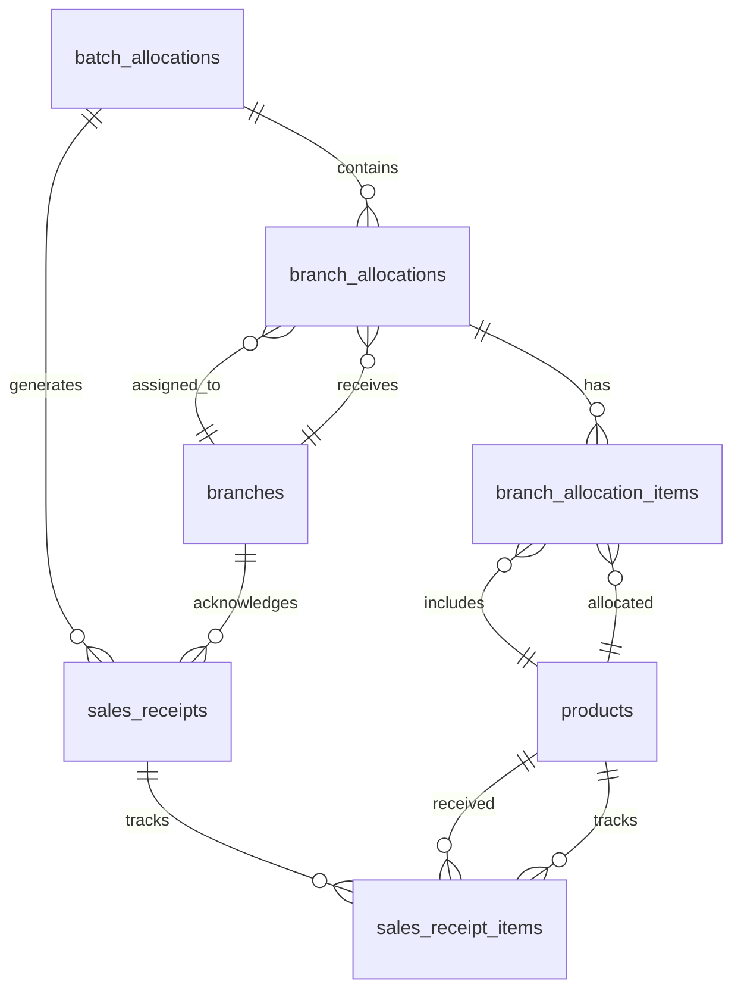

# Allocation System Documentation

## Overview

The Allocation System is a comprehensive two-way inventory management solution that manages the flow of goods from **Warehouse** to **Sales/Branches**. It consists of two main interfaces:

- **Warehouse Interface** (`/allocation/warehouse`) - For creating and managing batch allocations
- **Sales Interface** (`/allocation/sales`) - For receiving and tracking goods at branch level

## System Architecture

The system follows a **Batch-Based Allocation Workflow** where:
1. **Warehouse** creates delivery batches
2. **Warehouse** allocates products to specific branches within batches
3. **Warehouse** dispatches batches to branches
4. **Sales/Branches** receive and track actual quantities received
5. **Sales/Branches** mark products as sold

## Database Schema

### Core Tables

```mermaid
erDiagram
    batch_allocations {
        id bigint PK
        ref_no string UK
        transaction_date date
        remarks text
        status string
        timestamps
    }
    
    branch_allocations {
        id bigint PK
        batch_allocation_id bigint FK
        branch_id bigint FK
        remarks text
        status string
        timestamps
    }
    
    branch_allocation_items {
        id bigint PK
        branch_allocation_id bigint FK
        product_id bigint FK
        quantity integer
        unit_price decimal
        timestamps
    }
    
    sales_receipts {
        id bigint PK
        batch_allocation_id bigint FK
        branch_id bigint FK
        status string
        date_received date
        timestamps
    }
    
    sales_receipt_items {
        id bigint PK
        sales_receipt_id bigint FK
        product_id bigint FK
        allocated_qty integer
        received_qty integer
        damaged_qty integer
        missing_qty integer
        sold_qty integer
        status string
        remarks text
        sold_at timestamp
        sold_by string
        timestamps
    }
    
    branches {
        id bigint PK
        name string
        code string
        category string
        address string
        remarks text
        timestamps
    }
    
    products {
        id bigint PK
        sku string UK
        barcode string UK
        name string
        price decimal
        cost decimal
        category_id bigint FK
        supplier_id bigint FK
        timestamps
    }
```

### Entity Relationships



## Warehouse Workflow

### Purpose
Warehouse users create, manage, and dispatch delivery batches to branches.

### Key Features
- **Batch Management**: Create and manage delivery batches
- **Branch Assignment**: Add branches to specific batches
- **Item Allocation**: Assign products and quantities to each branch
- **Dispatch Control**: Finalize and dispatch batches to branches
- **Collapsible Interface**: Clean card-based layout for better UX

### Workflow Steps

#### 1. Create Batch Allocation
```
Create New Batch → Set Transaction Date → Add Remarks → Save as Draft
```

**Database Impact**: Creates record in `batch_allocations` table

#### 2. Add Branches to Batch
```
Select Available Branches → Add Branch Remarks → Save Selection
```

**Database Impact**: 
- Creates records in `branch_allocations` table
- Links branches to specific batch

#### 3. Add Items to Branch Allocations
```
Select Product → Set Quantity → Add Unit Price (Optional) → Save Item
```

**Database Impact**:
- Creates records in `branch_allocation_items` table
- Links products to specific branch allocations

#### 4. Dispatch Batch
```
Validation: Check all branches have items → Confirm Dispatch → Create Sales Receipts
```

**Database Impact**:
- Updates `batch_allocations.status` to 'dispatched'
- Creates records in `sales_receipts` table
- Creates records in `sales_receipt_items` table with initial 'pending' status

### Status Flow (Warehouse)
```
Draft → Allocated → Dispatched
```

## Sales Workflow

### Purpose
Sales team receives, validates, and tracks actual goods received at branches.

### Key Features
- **Batch Selection**: Choose from dispatched batches
- **Receipt Confirmation**: Validate and confirm actual quantities received
- **Damage Tracking**: Record damaged and missing items
- **Sales Tracking**: Mark items as sold with timestamps
- **Item Editing**: Adjust quantities before final confirmation

### Workflow Steps

#### 1. Select Batch for Receipt
```
Choose Batch from Dropdown → Load Branch Receipts
```

**UI**: Shows table of branches in the selected batch with:
- Branch names
- Total items allocated
- Received vs Allocated quantities
- Current status

#### 2. View Receipt Details
```
Click "View Allocation" → Open Detailed Modal
```

**UI**: Shows comprehensive view with:
- Batch information (ref_no, transaction date)
- All items with detailed quantities
- Status tracking for each item
- Action buttons based on status

#### 3. Confirm Receipt (For Pending Status)
```
Click "Confirm Receipt" → Adjust Quantities → Save
```

**UI Modal Fields**:
- Received Quantity (required)
- Damaged Quantity (optional)
- Missing Quantity (auto-calculated)

**Database Impact**:
- Updates `sales_receipts.status` to 'received'
- Updates `sales_receipt_items` with actual quantities
- Calculates `missing_qty` as: `allocated_qty - (received_qty + damaged_qty)`

#### 4. Edit Item Details (Before Confirmation)
```
Click "Edit" → Modify Quantities → Update
```

**Database Impact**:
- Updates `sales_receipt_items` with new quantities
- Only allowed before receipt confirmation

#### 5. Mark Items as Sold (After Receipt)
```
Click "Mark Sold" → Update Status
```

**Database Impact**:
- Updates `sold_qty` in `sales_receipt_items`
- Sets `sold_at` timestamp
- Sets `sold_by` to 'System'
- Updates item status: `partial_sold` or `sold`

### Status Flow (Sales)
```
Pending → Received → (Partial_Sold | Sold)
```

## Key Components

### Livewire Components

#### Warehouse Component (`app/Livewire/Pages/Allocation/Warehouse.php`)
- **Models**: `BatchAllocation`, `BranchAllocation`, `BranchAllocationItem`
- **Key Methods**:
  - `createBatch()`: Creates new batch allocation
  - `addBranchesToBatch()`: Adds branches to batch
  - `addItemToBranch()`: Adds items to branch allocation
  - `dispatchBatch()`: Dispatches batch and creates sales receipts
  - `removeBranch()`: Removes branch from batch
  - `removeItem()`: Removes item from allocation

#### Sales Component (`app/Livewire/Pages/Allocation/Sales.php`)
- **Models**: `SalesReceipt`, `SalesReceiptItem`, `BatchAllocation`
- **Key Methods**:
  - `loadBatchReceipts()`: Loads branch receipts for selected batch
  - `viewReceiptDetails()`: Shows detailed receipt modal
  - `confirmReceipt()`: Confirms receipt with actual quantities
  - `updateItem()`: Updates individual item details
  - `markAsSold()`: Marks items as sold

### Blade Templates

#### Warehouse Template (`resources/views/livewire/pages/allocation/warehouse.blade.php`)
- **Features**:
  - Collapsible batch cards (closed by default)
  - Real-time form validation
  - Modal-based workflows
  - Status-based action buttons
  - Dark mode support

#### Sales Template (`resources/views/livewire/pages/allocation/sales.blade.php`)
- **Features**:
  - Batch selection dropdown
  - Branch receipt table
  - Detailed receipt modals
  - Quantity confirmation forms
  - Status tracking with color coding

### Custom Components

#### Batch Card (`resources/views/components/batch-card.blade.php`)
- **Purpose**: Provides collapsible functionality for batch display
- **Features**:
  - Click-to-expand/collapse
  - Smooth animations with Alpine.js
  - Default closed state for better UX
  - Dark mode compatible

## Data Flow

### 1. Batch Creation Flow
```
Warehouse Creates Batch → Adds Branches → Adds Items → Dispatches
```

**Data States**:
- `batch_allocations.status = 'draft'` → `'dispatched'`
- Creates `sales_receipts` and `sales_receipt_items` records

### 2. Receipt Processing Flow
```
Sales Selects Batch → Views Details → Confirms Receipt → Tracks Sales
```

**Data States**:
- `sales_receipts.status = 'pending'` → `'received'`
- `sales_receipt_items` quantities updated with actual values
- `sales_receipt_items.status` updated based on sales

## Business Rules

### Warehouse Rules
1. **Draft Status Only**: Can only modify batches with 'draft' status
2. **No Empty Dispatches**: Cannot dispatch batch without branches or items
3. **Unique References**: Batch reference numbers must be unique
4. **Cascade Deletion**: Removing branch/allocation removes all related items

### Sales Rules
1. **No Post-Receipt Edits**: Cannot edit items after receipt confirmation
2. **Quantity Validation**: Total received + damaged cannot exceed allocated quantity
3. **Sales Validation**: Cannot sell more than available quantity
4. **Status Progression**: Items move through logical status flow

## Status Definitions

### Batch Statuses
- **Draft**: Editable, can add branches/items
- **Dispatched**: Locked, sent to branches for receipt

### Branch Allocation Statuses
- **Pending**: Waiting for branch assignment
- **Allocated**: Branches added, items assigned
- **Received**: Branch confirmed receipt

### Receipt Item Statuses
- **Pending**: Waiting for branch confirmation
- **Received**: Branch confirmed quantities
- **Partial Sold**: Some quantity sold
- **Sold**: All quantity sold

## Error Handling

### Validation Rules
- **Required Fields**: Transaction dates, reference numbers
- **Quantity Validation**: Non-negative integers for all quantities
- **Business Logic**: Cannot exceed allocated quantities
- **Status Validation**: Actions only allowed for appropriate statuses

### User Feedback
- **Success Messages**: Green notifications for successful actions
- **Error Messages**: Red notifications for validation failures
- **Loading States**: Clear indicators during data processing
- **Confirmation Dialogs**: For destructive actions (deletion, dispatch)

## Performance Considerations

### Database Indexes
- Foreign key relationships properly indexed
- Status fields indexed for filtering
- Reference numbers indexed for uniqueness

### UI Performance
- **Livewire Optimization**: Real-time updates with minimal re-renders
- **Alpine.js**: Client-side interactions for smooth UX
- **Lazy Loading**: Collapsible cards reduce initial page load
- **Form Validation**: Real-time validation prevents unnecessary submissions

## Security Features

### Access Control
- **Role-Based**: Actions restricted by user permissions
- **Transaction Safety**: Database transactions ensure data integrity
- **Cascade Protection**: Proper foreign key constraints prevent orphaned records

### Data Integrity
- **Validation**: Server-side and client-side validation
- **Constraints**: Database constraints enforce business rules
- **Audit Trail**: Timestamps track all changes
- **Soft Deletes**: Optional for critical data

## Future Enhancements

### Potential Features
1. **Barcode Scanning**: Integrate barcode scanning for quick receipt
2. **Photo Capture**: Allow photo attachments for damaged goods
3. **Real-time Updates**: WebSocket integration for live status updates
4. **Reporting**: Generate allocation and receipt reports
5. **Mobile App**: Dedicated mobile interface for field use
6. **Advanced Analytics**: Track delivery accuracy and sales performance

### API Development
- RESTful API endpoints for mobile applications
- GraphQL support for complex data queries
- Webhook integration for external system notifications

## Troubleshooting

### Common Issues

#### 1. Batch Won't Dispatch
- **Cause**: Missing branches or items
- **Solution**: Add at least one branch with items

#### 2. Cannot Edit Receipt
- **Cause**: Receipt already confirmed
- **Solution**: Contact admin to reset receipt status

#### 3. Missing Quantities
- **Cause**: Calculation error in UI
- **Solution**: Refresh page and re-enter data

#### 4. Modal Not Closing
- **Cause**: JavaScript error
- **Solution**: Clear browser cache and refresh

### Debug Tools
- **Laravel Debug Bar**: SQL queries and performance metrics
- **Browser DevTools**: JavaScript errors and network requests
- **Livewire Debugger**: Component state and method calls
- **Database Logs**: Query execution and error tracking

## Support and Maintenance

### Regular Maintenance
- **Database Cleanup**: Archive old completed batches
- **Index Optimization**: Monitor query performance
- **Cache Clearing**: Clear application and view caches
- **Backup Strategy**: Regular database backups

### Monitoring
- **Error Tracking**: Monitor application errors
- **Performance Metrics**: Track page load times
- **User Activity**: Monitor system usage patterns
- **Data Consistency**: Regular data integrity checks

---

**Last Updated**: November 2025  
**Version**: 1.0  
**Maintained By**: Development Team